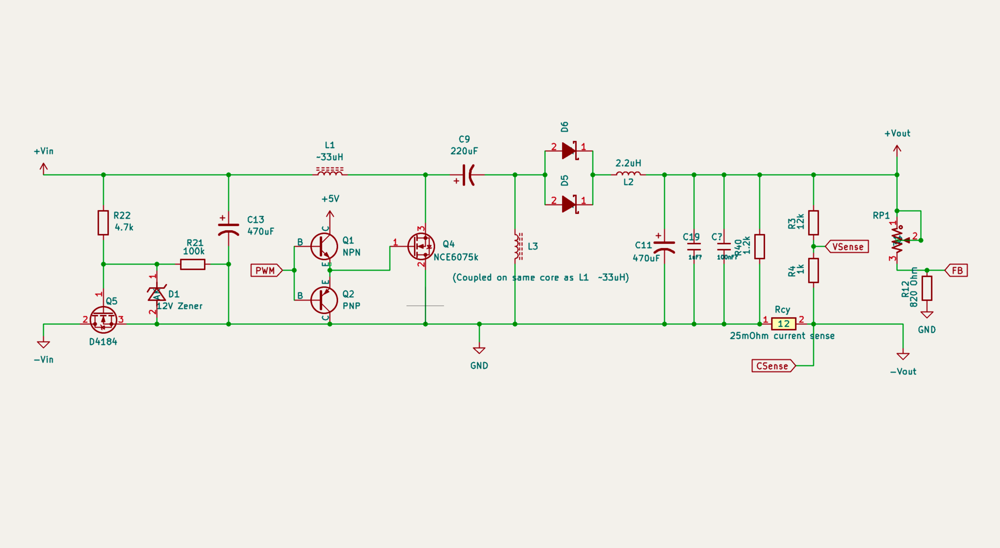

# HW-140 Buck-Boost Module Teardown

Reverse-engineered schematic and notes for the HW-140, a cheap SEPIC buck-boost converter module from AliExpress.

## Circuit Summary

The HW-140 is a SEPIC (Single-Ended Primary-Inductor Converter) that can buck or boost its input voltage using a single switching MOSFET. A coupled inductor pair transfers energy through a coupling capacitor, and the duty cycle of the switch continuously sets the output voltage above or below the inpu.

The board includes an LCD display, adjustable CV/CC control via trimpots, reverse polarity protection on the input, and an LC output filter for reduced ripple.

**Specs (from listing):** 5.5-30V in, 0.5-30V out, 3A (4A with cooling), 35W (50W with cooling), ~180kHz switching frequency.

## Key Components

| Ref | Part | Description | Datasheet |
|-----|------|-------------|-----------|
| U1 | FP5139 | Asynchronous boost/SEPIC PWM controller | [datasheet](https://www.lcsc.com/datasheet/C88318.pdf) |
| Q4 | NCE6075K | 60V/75A N-ch MOSFET, main switch (TO-252) | [datasheet](https://www.lcsc.com/datasheet/C110912.pdf) |
| Q5 | D4184 | 40V/60A N-ch MOSFET, input reverse polarity protection (TO-252) | [datasheet](https://www.lcsc.com/datasheet/C41430588.pdf) |
| D5, D6 | SS56 | 5A/60V Schottky rectifier diodes (x2 in parallel) | [datasheet](https://www.lcsc.com/datasheet/C65009.pdf) |
| U2 | HT7550 | 5V LDO regulator for logic supply | [datasheet](https://www.lcsc.com/datasheet/C41378109.pdf) |
| U3 | LM358 | Dual op-amp, CC sense amplification | [datasheet](https://www.lcsc.com/datasheet/C2977710.pdf) |
| U4 | HT1621B | LCD controller | [datasheet](https://www.holtek.com.cn/webapi/116706/HT1621_21Gv340.pdf) |
| L1, L3 | ~33uH coupled | Main SEPIC inductors, wound on shared ferrite core | -- |
| L2 | 2.2uH | Output LC filter inductor | -- |
| C9 | 220uF/35V | SEPIC coupling capacitor | -- |
| C13 | 470uF/35V | Input bulk capacitor | -- |
| C11 | 470uF/35V | Output bulk capacitor | -- |
| Rcy1 | 25mOhm | Output current sense resistor | -- |

## Replacement MOSFET

The original NCE6075K was destroyed during stress testing. It was replaced with an [Infineon IRLZ44N](https://www.infineon.com/assets/row/public/documents/24/49/infineon-irlz44n-datasheet-en.pdf?fileId=5546d462533600a40153567217c32725) (55V/47A, logic-level). Lower current rating, but fully enhanced at the 5V gate drive this board provides.

## Schematic

The KiCad schematic (`hw140.kicad_sch`) is a reverse-engineered approximation of the power stage, traced from the PCB.
